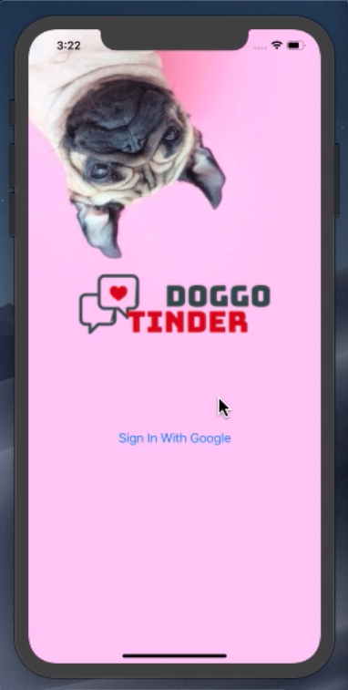
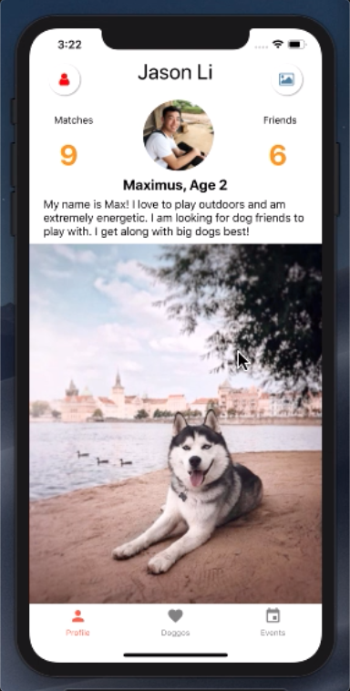
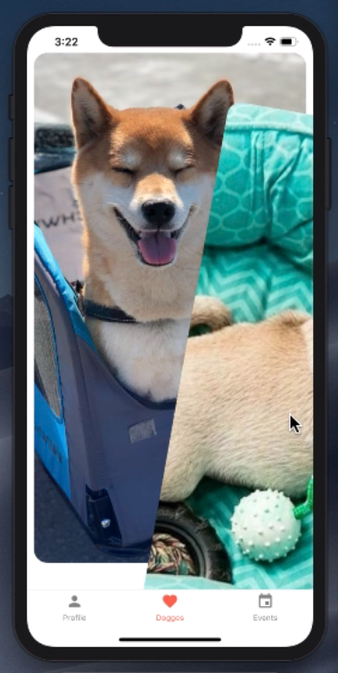
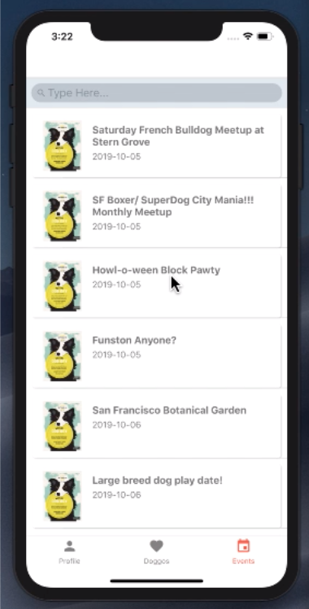

# DogTinder
Doggo Tinder

A social media app for iOS and Android for dog owners to meet up with nearby dog users and create playdates for their best friends.
video : bit.ly/doggotinder

# Features

## Sign in with Google
Doggo Tinder let's you sign in with google to create a premade account using your google profile picture, name, and location.

## Swipe on other dogs
The main screen has three different tabs. The homescreen (middle) of them allows the user to swipe left or right on dogs you think your pup would
get along with the best. Your corgi loves chihuahuas for some reason?? Swipe right!

## User profile
The most left tab allows users to build their profiles, along with displaying the number of friends and matches your dog has. Add a description
about your pet and upload pictures via your camera roll. Uploads are directly uploaded to AWS S3 via your mobile device and pulled down and stored in
Google Firebase.

## Meetups
The right tab allows users to view nearby dog-friendly events in the user's current location. This called meetup.com API to determine popular
events.
